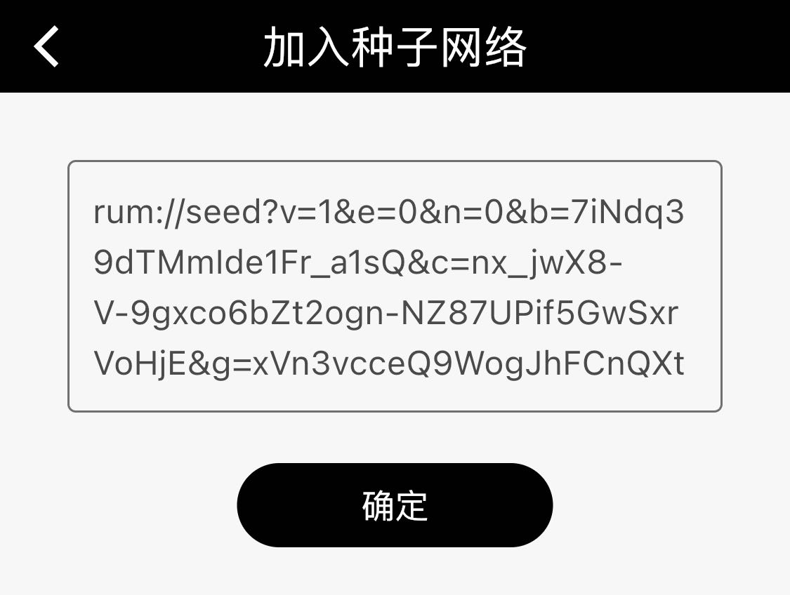

# 从这里开始 Rum

### 简介

<details>

<summary>简介内容</summary>

#### Rum：

Rum 是搭建在 Rum System 提供的去中心网络上的应用，Rum 官方团队开发了满足不同场景的去中心化应用（DApp）来展示 Rum System 的诸多可能。为构建平行互联网世界提供无限的想象空间。

[ying-yong-xia-zai.md](ying-yong-xia-zai.md "mention")


#### 节点：

节点组成了 Rum Network，其中全节点可以出块，轻节点不能出块，但能加入种子网络从链上读取数据。


#### Rum System：

Rum System 由 Quoum 和 Rum Network 组成。到官方主页 [rumsystem.net](http://rumsystem.net) 了解更多。&#x20;


#### 种子网络：

种子网络为各类 Rum 应用提供内容数据。根据不同的使用场景，包括微博，论坛，聊天室，来呈现链上数据。

</details>

### 快速开始

#### 1. 我们推荐新用户下载下列应用以体验 Rum：



下载移动轻节点客户端：

安卓用户点击下载安装包


iPhone 用户需要先安装 TestFlight：

点击此链接打开安装页面

或用手机扫描二维码打开安装页面

{二维码}



点击以下链接，下载相应系统的全节点 Rum 应用：

1. Windows 安装包，支持 Windows 7.0 及以上版本
2. MacOS 安装包
3. Linux 安装包



#### 2. 复制种子文本，用以加入{新版种子大全}

```
rum://seed?v=1&e=0&n=0&b=7iNdq39dTMmIde1Fr_a1sQ&c=nx_jwX8-V-9gxco6bZt2ogn-NZ87UPif5GwSxrVoHjE&g=xVn3vcceQ9WogJhFCnQXtA&k=A_iyXgC2kvs8EZjh0iNb6P12MqE2D3FbrsYJ5Vdow0tr&s=GTo9VYQMWWjca5UcY6ET28ijxOTWFHxk7BGOVyb2okNLmndy9vVjmiXQro6YWdczgryVYtoptU2G6BKc5QZJDQE&t=FwdrP2wzc9g&a=%E6%96%B0%E7%89%88%E7%A7%8D%E5%AD%90%E5%A4%A7%E5%85%A8&y=group_post&u=https%3A%2F%2F103.61.39.95%3Fjwt%3DeyJhbGciOiJIUzI1NiIsInR5cCI6IkpXVCJ9.eyJhbGxvd0dyb3VwcyI6WyJjNTU5ZjdiZC1jNzFlLTQzZDUtYTg4MC05ODQ1MGE3NDE3YjQiXSwiZXhwIjoxODE3MDkyOTEyLCJuYW1lIjoiYWxsb3ctYzU1OWY3YmQtYzcxZS00M2Q1LWE4ODAtOTg0NTBhNzQxN2I0Iiwicm9sZSI6Im5vZGUifQ.9-jFxogmNe1DlAJvfDUhR7ZdwKt6TY-ZqYab-sRFSBo
```

#### 3. 在 Rum 客户端中点击加号，粘贴种子文本，加入种子网络



#### 如果是电脑客户端，需要耐心等待 5 分钟，全节点需要进行同步


#### 启航，探索更多的可能


进入下一章节\[应用下载]，发现更多建立在 RumSystem 上的 DApp。

