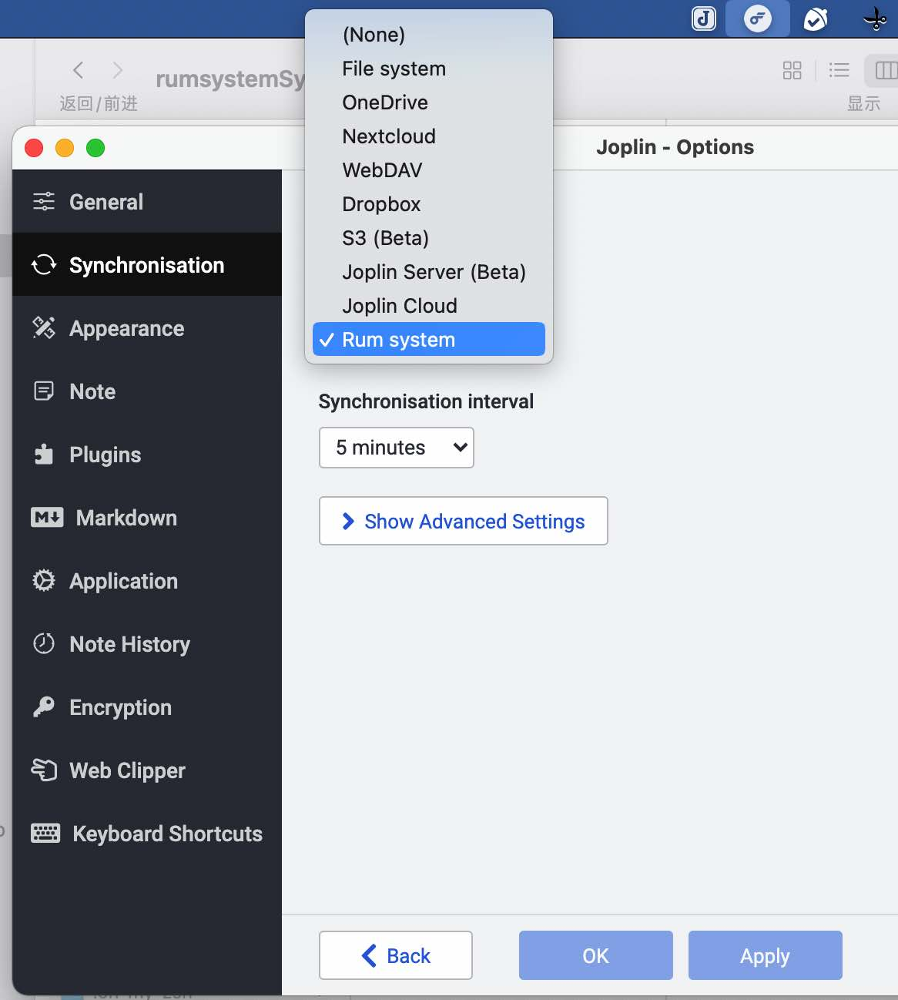
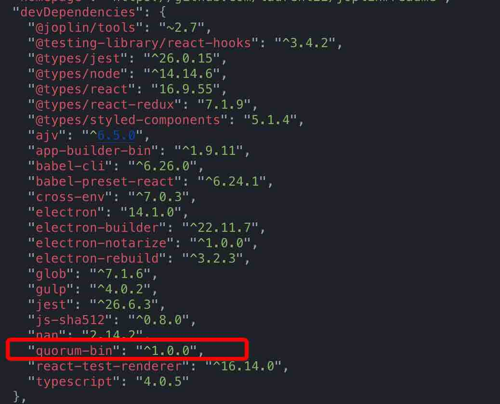
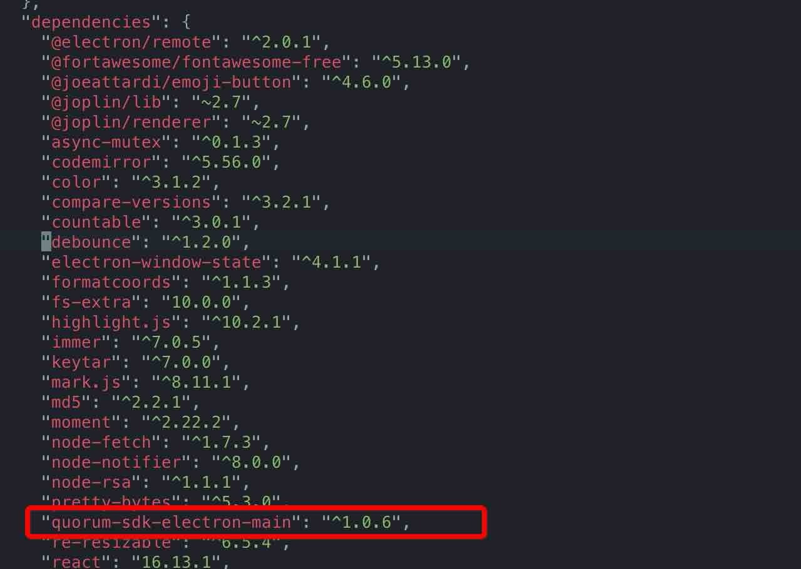

# RUM-SDK 接入案例 

---

**本文以 joplin 为例，展示第三方 electron 客户端在接入 rum-sdk 过程中的注意事项及主要流程。**

## RUM-SDK 接入前的注意事项
### 一、RUM-SDK 与 AWS3-SDK 等 SDK 的不同
1. 传统的客户端 SDK 通常只是作为连接 server 的 client 而存在，但 RUM-SDK 则不同，在使用的过程中既要引入作为 client 的 Quorum-sdk-electron-renderer 供连接使用，也要在应用中引入 Quorum-sdk-electron-main 用来管理 server。简而言之，使用 RUM-SDK 不但需要管理 client 同时也需要管理 server。 2. 传统的客户端 SDK 存储数据更多的是将数据以文件为单位进行存储，而 RUM-SDK 则是将具体的内容做为消息存储，且现阶段还不支持上传文件。
3. RUM-SDK 存储的数据完全属于用户私有，并不依赖于中心化的存储提供商，详情请看：[RumSystem](https://rumsystem.net/)。

### 二、RUM-SDK 与 FileSystem 的不同
1. 虽然 RUM-SDK 的数据同样会存储在本地，但它的数据结构完全不同于 FileSystem。
2. RUM-SDK 存储的数据处理在本地存在一份外，更重要的是具备 Quorum 赋予的将数据同步到其对应的私有区块链上的能力，可以理解为去中心化的分布式存储。

### 三、使用 RUM-SDK 的目的
1. 是优先维持现有的软件功能逻辑并将 RUM-SDK 的功能整合还是基于 RUM-SDK 完全改造现有的 app 。
2. 前者更多的是把 RUM-SDK 作为一个工具选项嵌入，而后者则是将使用 RUM-SDK 作为终极目的。
3. 前者更根据需要将 RUM-SDK 的功能做选取和整合并适配现有逻辑，而后者则会对现有 app 做功能上的扩充以发掘 RUM-SDK 更多的潜力。

### 四、使用 RUM-SDK 的三个方面
1. 对节点服务进行管理
2. 对种子网络（群组）进行管理
3. 对数据交互进行管理

## RUM-SDK 的接入流程
### Joplin 是什么？
[Joplin](https://joplinapp.org/) is an open source note-taking app. Capture your thoughts and securely access them from any device.

### Joplin 接入方案概览
1. 考虑到 Joplin 作为一个开源多年的项目，具备大量的基础用户群体，所以本次 RUM-SDK 的接入的初衷是尽可能保持 Joplin 的功能原貌，使用尽可能少的破坏性将 RUM-SDK 作为一个可选的同步配置项整合到 Joplin 当中。
2. Joplin 支持各种类型的文件附件，但由于目前 Quorum 项目还在快速迭代中，目前还不支持各种类型的文件上传，因而本版本的接入只是将 Joplin 的文本信息提交到了 Quorum 链接。
3. Joplin 本身设计的多平台多设备同步，而 RUM-SDK 目前仅有 Elctron 对应的版本，所以移动端平台暂不支持。
4. Joplin 的桌面端多设备同步，依赖于更复杂的种子网络管理功能，由于多设备同步实现起来有几个方案，且都不同程度涉及到正在快速迭代中的功能，故而 Joplin 的第一个版本，对于种子网络管理这块采用了最简单的方案，既本地单一默认群组同步方案。将重点放在了 Joplin 和 Quorum 的数据联通上。

基于这个方案，最终 joplin 处理选项的同步设置里面多了一项 RumSystem 外，其他功能逻辑均为 joplin 原有逻辑，用户基本属于无感。



### 接入项目地址
[joplin-with-rum](https://github.com/rumsystem/joplin-with-rum)

### 接入过程
#### 1. RUM-SDK 的引入
- 按照 quorum-sdk-electron-main 的文档，在 [packages/app-desktop](https://github.com/rumsystem/joplin-with-rum/tree/dev-rum/packages/app-desktop) 目录下安装对应于主进程的 sdk , 并修改 [package.json](https://github.com/rumsystem/joplin-with-rum/blob/dev-rum/packages/app-desktop/package.json) 文件，添加打包相关的资源配置。安装好后，确认 [package.json](https://github.com/rumsystem/joplin-with-rum/blob/dev-rum/packages/app-desktop/package.json) 的 devDependencies 以及 dependencies 是否出现如下对应两项。 




- 按照 quorum-sdk-electron-renderer 的文章，在 [packages/lib](https://github.com/rumsystem/joplin-with-rum/tree/dev-rum/packages/lib) 目录下安装对应于渲染进程的 sdk。安装好后，确认对应的[package.json](https://github.com/rumsystem/joplin-with-rum/blob/dev-rum/packages/lib/package.json) 的dependencies出现如下项目。
    


至此，rum-sdk 就引入了项目。值得说明的是，quorum-sdk-electron-renderer 之所以不在 [packages/app-desktop](https://github.com/rumsystem/joplin-with-rum/tree/dev-rum/packages/app-desktop) 引入是因为，按照 joplin 的开发规范工具类的方法都是放在 [packages/lib](https://github.com/rumsystem/joplin-with-rum/tree/dev-rum/packages/lib) 下，并在项目里应用。实际上，在 [packages/app-desktop](https://github.com/rumsystem/joplin-with-rum/tree/dev-rum/packages/app-desktop) 里引用，并在各前端组件里按需使用也是可以的。这里是对 quorum-sdk-electron-renderer 做了一个二次封装。

#### 2. RUM-SDK 的使用
- quorum-sdk-electron-main 的调用。主需要在 electron 项目的 [main.js](https://github.com/rumsystem/joplin-with-rum/blob/dev-rum/packages/app-desktop/main.js) 主文件引入模块，并简单的执行以下 init 就可以了。


这里主要注意的是，quorumBinPath 用于确定打包后及开发中使用的 quorum 程序的安装位置。开发中使用的是前面按在的 quorum-bin 项目在 node_modules 的位置。而打包后，安装到的是程序主目录下的 quorum-bin 里。但使用这个位置的时候，在 linux 的打包就需要设置打包后的目标文件为 zip 格式。因为如果是 AppImage 格式，后续 quorum 程序由于 AppImage 的工作机制产生的权限问题会导致无法创建相应的资源文件。在 windows 打包，则需要主要，使用全局安装后，需要使用管理员模式运行程序才能正常使用 quorum。

**这里需要注意的事，根据使用的 elctron 脚手架的不同，这里配置的应用路径也会有所不同，一个配置不同的例子是：[electron with vue&vite issue](https://github.com/rumsystem/quorum-sdk-electron-main/issues/1)**

- quorum-sdk-electron-renderer 的调用。使用 renderer 的 sdk 时，需要 new 一个实例。每个实例里都记录了与 quorum server 通讯的相关信息, 因而在不同组件间共享实例就是一个需要关注的问题。在给 Joplin 接入 renderer sdk 时，遵循了 joplin 的规范，封装了 [packages/lib/QuorumServer.ts](https://github.com/rumsystem/joplin-with-rum/blob/dev-rum/packages/lib/QuorumServer.ts) 文件。QuorumServer 用于对 renderer 实例的管理，以及对 quorum server 的启动和停止。

其中需要重点注意的是启动 quorum server 的代码，如下
```
	async start() {
		this.setStartState(StartState.Starting);

		try {
			await this.client_.up();
			const groups = await this.client_.Group.list() || [];
			if (groups.length > 0) {
				Setting.setValue('sync.11.group', groups[0]);
			} else {
				const group = await this.client_.Group.create({
					group_name: 'joplin',
					consensus_type: 'poa',
					encryption_type: 'public',
					app_key: 'group_note',
				});
				Setting.setValue('sync.11.group', group);
			}
		} catch (error) {
			this.setStartState(StartState.Idle);
			this.logger().error(error);
			return;
		}

		this.logger().info('quorum started!');
		this.logger().info(`Synchronise on rumsystem group ${Setting.value('sync.11.group').group_id}`);

		this.setStartState(StartState.Started);
	}

	async stop() {
		this.client_.down();
		this.logger().info('quorum stoped!');
		this.setStartState(StartState.Idle);
	}
```
因为 rum-sdk 是作为一个配置项接入 joplin 的。所以，quorum server 就需要按需启停。因而就需要提供启动与停止的 api，而非做成与 app 同步启停的服务。

这部分的逻辑用在两个地方，第一个是在启动 app 的时候，如果检测到使用 rum 作为同步源，则启动 quorum，这部分代码在 [packages/app-desktop/app.ts](https://github.com/rumsystem/joplin-with-rum/blob/1ff6fcb776e5795ead4c5f0df28540b549c574b7/packages/app-desktop/app.ts#L501) 中。第二个是在切换同步源时，根据切换前后是否含有 rum 而进行对应的启停，这部分代码在 [packages/lib/components/shared/config-shared.js](https://github.com/rumsystem/joplin-with-rum/blob/1ff6fcb776e5795ead4c5f0df28540b549c574b7/packages/lib/components/shared/config-shared.js#L86) 中。

以上就是 joplin 里对 quorum 进行节点管理的地方，也就是使用 rum-sdk 的第一个方面。

顺着 start 继续看，我们能看到前面提到的这里使用 rum-sdk 的第二个方面，种子网络管理部分。理由如前述，这里使用了最简单的种子网络管理。即只把 quorum 当作 joplin 的一个附属服务，quorum 只为 joplin 服务，因而也就只需要一个种子网络，如果启动节点后，有种子网络就使用他，如果没有就创建一个。因为现版本只考虑单机情况，所以群组类型使用的是 public 最简单的情况。

#### 3.数据上链（数据同步）
在前两步中，我们已经可以在应用中启动了对应的 quorum 节点及 group 种子网络了。之后就可以和种子网络交互数据了。

一般情况下，和种子网络的数据交互包含两部分。既数据提交上链，及数据上链后获取。但是因为 joplin 使用的是本地节点，且用户本身是种子网络的 owner，所以这个过程可以视作实时的。

joplin 与同步源的数据同步有两步，第一步是检测对比同步源及本地的文件差异，第二步是更新本地文件或同步源中的文件信息。

在 joplin 当中与同步源的数据对接主要是通过 [file-api](https://github.com/rumsystem/joplin-with-rum/blob/dev-rum/packages/lib/file-api.ts) 的子类来实现，所以为了实现 joplin 和 rum 的数据同步功能，实现了 [file-api-driver-rum.js](https://github.com/rumsystem/joplin-with-rum/blob/dev-rum/packages/lib/file-api-driver-rum.js) 子类。

[file-api-driver-rum.js](https://github.com/rumsystem/joplin-with-rum/blob/dev-rum/packages/lib/file-api-driver-rum.js) 的注册及调用涉及到 joplin 本身的业务逻辑，本文重点在于讲解 rum-sdk 的使用，故而这部分不做介绍，感兴趣的话可以执行阅读 joplin 源码。本部分重点介绍 [file-api-driver-rum.js](https://github.com/rumsystem/joplin-with-rum/blob/dev-rum/packages/lib/file-api-driver-rum.js) 中的数据 api 使用。

如前所述，rum 目前还不知道各类附件的上传，而 joplin 本身是支持各类附件的。所以，在 rum 的同步方案中，实际上是一种混合方案，将 附件等文件以 filesystem 的方式同步到 joplin 的配置文件夹中，而把文档内容上链。完整的整合代码请看 [file-api-driver-rum.js](https://github.com/rumsystem/joplin-with-rum/blob/dev-rum/packages/lib/file-api-driver-rum.js)，下面我们选取几个基础的方法来具体说明 rum 和 joplin 的数据交互。

由于 joplin 的同步设计的是面向文件存储的，所以在使用 rum 的时候我们将需要同步的文件的 path 作为 rum 的object_id

```
	async put(path, content, options = null) {
		console.log('put: ', path);
		console.log('save in local: ', this.isLocalFile(path));
		if (!options) options = {};
		if (this.isLocalFile(path) || !path) {
			path = this.localFileFullPath(path);
			try {
				if (options.source === 'file') {
					await this.fsDriver().copy(options.path, path);
					return;
				}

				await this.fsDriver().outputFile(path, content, 'utf8');
			} catch (error) {
				throw this.fsErrorToJsError_(error, path);
			}
		} else {
			const keyPath = path;
			if (options.source === 'file') {
				try {
					const content = await this.fsDriver().readFile(options.path);
					const QuorumClient = QuorumServer.instance().client();
					const group = Setting.value('sync.11.group');
					const object = await QuorumClient.Object.put(group.user_pubkey, {
						type: 'Add',
						object: {
							id: keyPath,
							type: 'Note',
							content: content,
						},
						target: {
							id: group.group_id,
							type: 'Group',
						},
					});
				} catch (error) {}
				return;
			}

			try {
				const QuorumClient = QuorumServer.instance().client();
				const group = Setting.value('sync.11.group');
				const object = await QuorumClient.Object.put(group.user_pubkey, {
					type: 'Add',
					object: {
						id: keyPath,
						type: 'Note',
						content: content,
					},
					target: {
						id: group.group_id,
						type: 'Group',
					},
				});
			} catch (error) {}
		}
	}

	async get(path, options) {
		console.log('get: ', path);
		console.log('save in local: ', this.isLocalFile(path));
		let output = null;
		if (this.isLocalFile(path) || !path) {
			path = this.localFileFullPath(path);
			try {
				if (options.target === 'file') {
					// output = await fs.copy(path, options.path, { overwrite: true });
					output = await this.fsDriver().copy(path, options.path);
				} else {
					// output = await fs.readFile(path, options.encoding);
					output = await this.fsDriver().readFile(path, options.encoding);
				}
				console.log(output);
			} catch (error) {
				if (error.code == 'ENOENT') return null;
				throw this.fsErrorToJsError_(error, path);
			}
		} else {
			try {
				const QuorumClient = QuorumServer.instance().client();
				const object = await QuorumClient.Object.get(path);
				output = object?.Content?.content || null;
				console.log(output);
				if (options.target === 'file') {
				  await this.fsDriver().outputFile(options.path, output, 'utf8');
				}
			} catch (error) {
				console.log(error);
			}
		}
		return output;
	}
```
joplin 的 put, get 的方法比较简单，主要是对 path 的文件的内容进入存取，如果有目标文件，则从对应的文件读取内容或将其内容写入对应的文件。在这一步，我们将作为消息的 object 通过 id 和 content 模拟了本地的文件同步数据类型。

这对应了同步的第二个步骤，读取或写入同步源内容。我们现在回到第一步，及判断同步源和本地文件的内容更新情况。

```
	async delta(path, options) {
		console.log('delta: ', path);
		console.log('save in local: ', this.isLocalFile(path));

		const getDirStats = async path => {
			const result = await this.list(path);
			return result.items;
		};

		return await basicDelta(path, getDirStats, options);
	}

	async list(path) {
		console.log('list: ', path);
		console.log('save in local: ', this.isLocalFile(path));
		const getFileSystemList = async (path) => {
			try {
				path = this.localFileFullPath(path);
				const stats = await this.fsDriver().readDirStats(path);
				console.log(stats);
				const output = this.metadataFromStats_(stats);
				console.log(output);
				return output;
			} catch (error) {
				throw this.fsErrorToJsError_(error, path);
			}
		}
		const getRumSystemList = async (path) => {
			try {
				const QuorumClient = QuorumServer.instance().client();
				let objects = await QuorumClient.Object.list();
				if (path) {
					const reg = new RegExp('^' + path);
					objects = objects.filter(object => reg.test(object.Content.id));
					console.log(objects);
					objects = objects.map(this.metadataFromObject_).map(object => this.remotePrefixPath_(object, path));
					console.log(objects);
				} else {
					console.log(objects);
					objects = objects.map(this.metadataFromObject_);
					console.log(objects);
				}
				return objects;
			} catch (error) {
				console.log(error);
			}
		}
		let output;
		if (!path) {
			const fileOutput = await getFileSystemList(path);
			const rumOutput = await getRumSystemList(path);
			output = fileOutput.concat(rumOutput);
		} else {
			if (this.isLocalFile(path)) {
				output = await getFileSystemList(path);
			} else {
				output = await getRumSystemList(path);
			}
		}
		return {
			items: output,
			hasMore: false,
			context: null,
		};
	}
```

这里看到 delta 方法，最终会调用 list 方法，而 list 方法会返回文件的 meta 信息用于判断本地和同步源的文件新旧情况。这里的代码稍显复杂，是因为整合了 filesystem 和 rum。只看的 rum 返回的 objects 的部分，可以看到 object 的 meta 其实是内容消息的信息，只是这里服从了 joplin 的meata 规范。

剩下的方法较为简单，就不一一介绍了，这里最复杂的地方是 filesystem 和 rum 的整合。未来如果 rum 支持了各类型文件上传，这个问题将变得更简单，甚至都不需要 object 去模拟 file。

## 总结
通过 joplin 的接入可以看到，使用 RUM-SDK 还是需要考虑一些问题的, 其中最主要的还是对 app 本身如何定位，以及现有业务 RUM 的关系。
在使用上，主要是三个方面：
1. 对节点服务进行管理
2. 对种子网络（群组）进行管理
3. 对数据交互进行管理

而其中结合不同业务而发生巨大变化的是第二部分。目前版本的 joplin 业务层面相对简单，且只是较为基础的整合。更复杂的使用功能请参见 [RumSystem](https://rumsystem.net/) 
